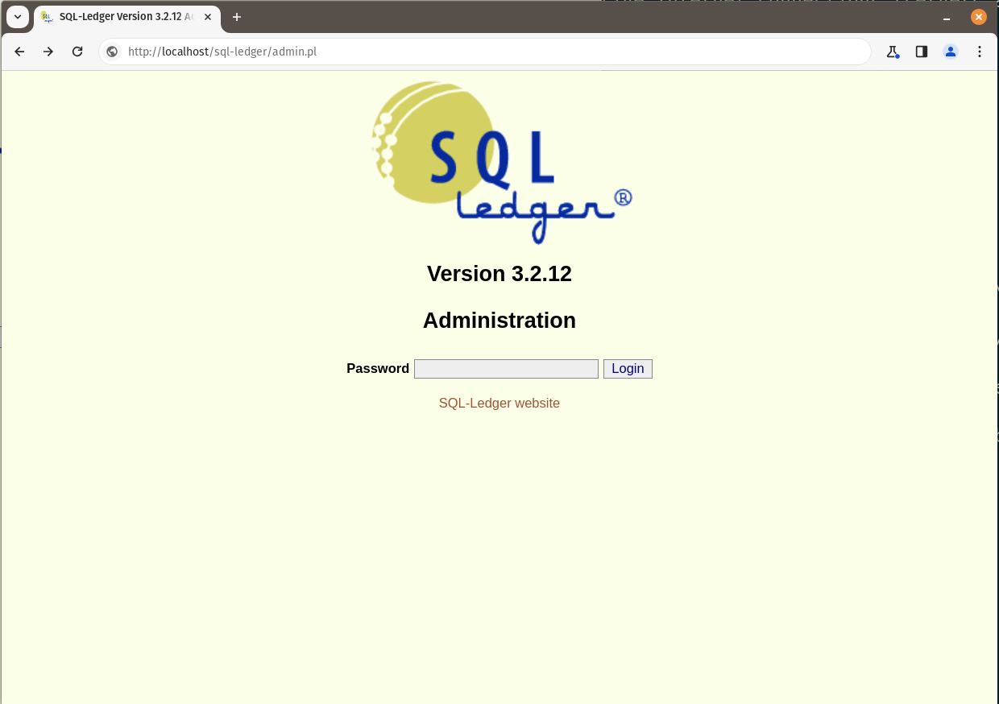
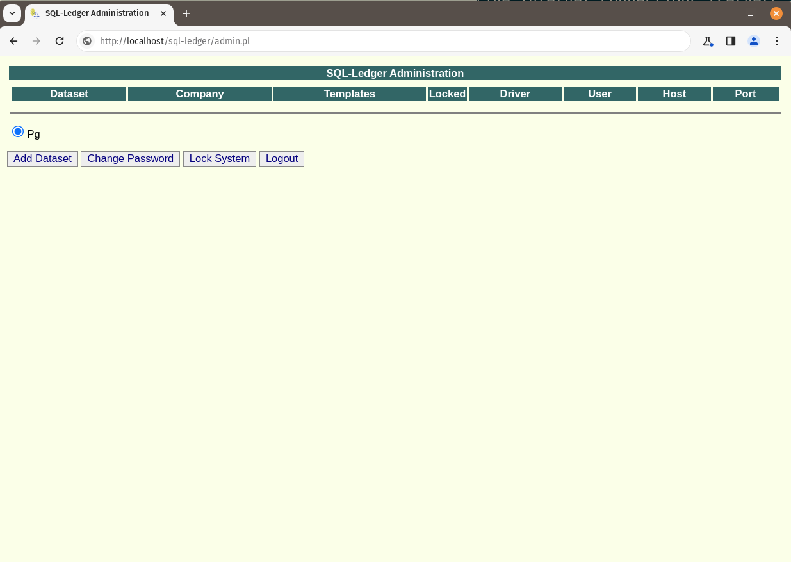
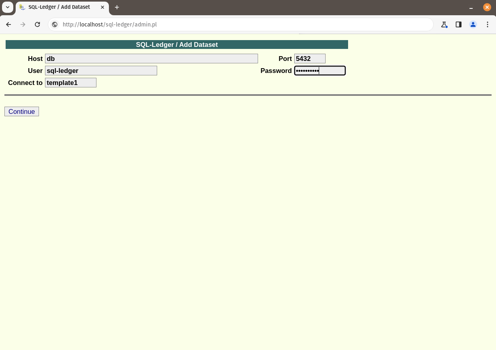
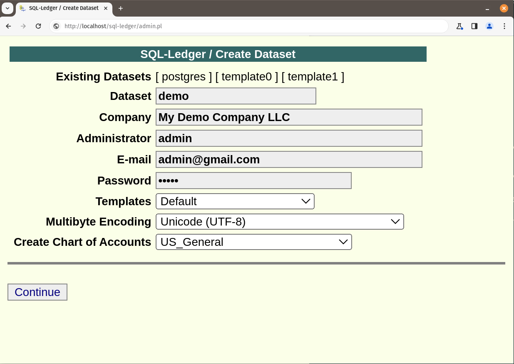
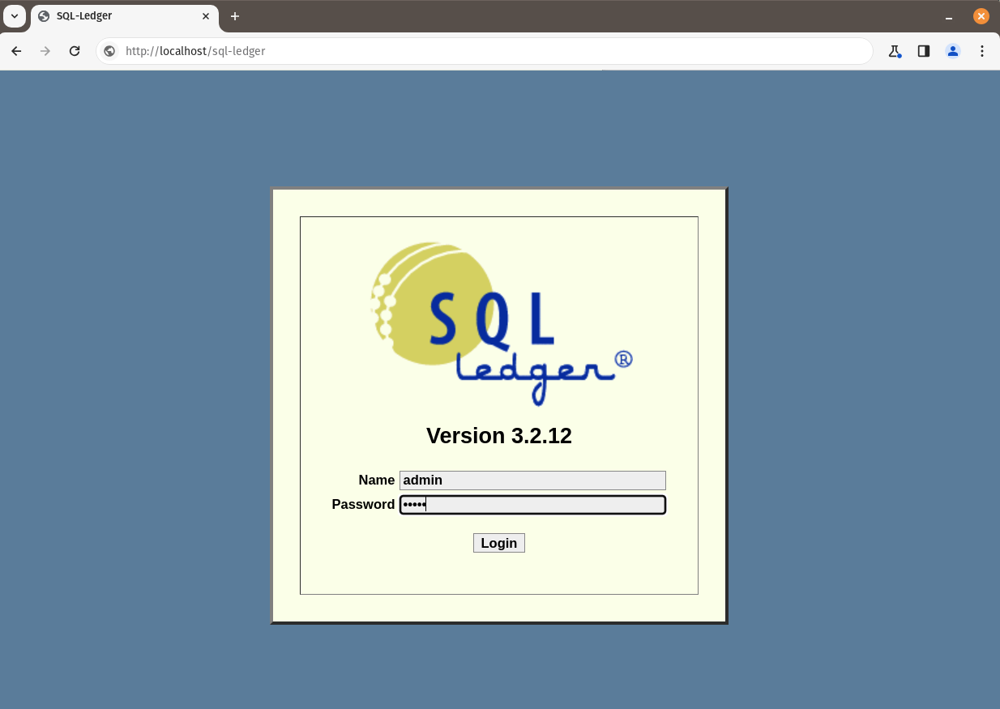
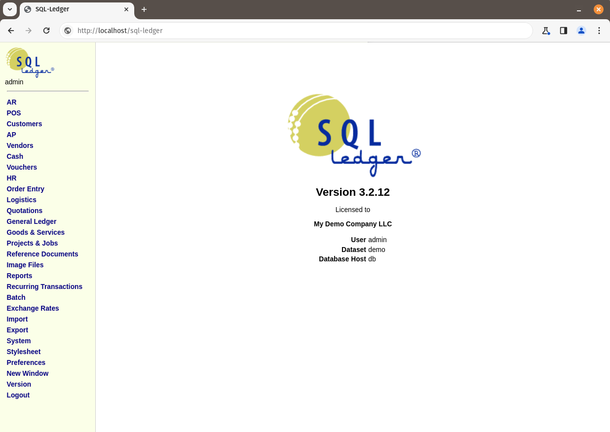

# Dockerized SQL-Ledger 

[](LICENSE) 


## Description

[SQL-Ledger](https://sql-ledger.com/cgi-bin/nav.pl?page=misc/terms.html&title=Legal%20Stuff) is a effortless business management application: intuitive and powerful. Seamlessly handle orders, invoices, inventory, and more with precision and ease.

Revolutionize your business management with SQL-Ledger, the dynamic web-based solution. Whether you're on a Mac, Windows or Linux system, experience seamless integration and unparalleled functionality.

Effortlessly streamline your operations with SQL-Ledger's comprehensive suite of features. From managing customer orders, shipments, and billing to handling purchase orders, vendor invoices, inventory, and general ledger tasks – it's all at your fingertips.

Say goodbye to steep learning curves. SQL-Ledger boasts an intuitive interface designed to empower users of all levels. Spend less time figuring out complex software and more time focusing on what matters most – growing your business.

Ready to take the leap? Try SQL-Ledger now and discover the efficiency and ease it brings to your business operations. Unlock the potential of your enterprise with a solution built for success.

## Table of Contents

- [Installation](#installation)
- [Usage](#usage)
- [Contributing](#contributing)
- [Support](#support)
- [License](#license)

## Installation

### Prerequisites

- [Docker](https://docs.docker.com/get-docker/)
- [git](https://git-scm.com/downloads)

### Installation

```bash
git clone https://github.com/ch1pp3w4/sl-docker.git
cd sl-docker
docker compose -f config.yml up
```

## Usage

### Setting up your Company data

1. Now, in the web broser point to http://localhost/sql-ledger/admin.pl, to create the database. Enter the following data:



Click the "Login" button, at this point, there is no password.

2. In the "SQL-Ledger Administration" screen:



Click on the "Add Dataset" button.

3. Enter the connection data to the database:



- Host: db
- Port: 5432    
- User: sql-ledger
- Password: sql-ledger
- Connect to: template1

Note: those are values that you should use; otherwise, SQL-Ledger won't get connected to the database container.

4. Finally, enter your company data (the below data is just for ilustrative purposes):



- Dataset: demo (this will be the database identificator for your company, change it to something that makes sense to you...)
- Company: My Demo Company LLC (your company's name)
- Administrator: admin (system administration user, tipically admin, superuser, sysadmin, it is up to you...)
- E-mail: admin@gmail.com (system administrator email address)
- Password: ***** (only numbers and letters, uppercase, and lowercase)
- Templates: Default (these are document templates in different languages; Default is English) 
- Multibyte Encoding: Unicode (UTF-8) (in this global world, there are multiple symbols, this technical piece supports those...)
- Create Chart of Accounts: US General (this is an example for illustrative purposes, click on the dropdown list, you can change it to whatever you want...)

Click over the "Continue" button. 

Control will be back into the "SQL-Ledger Administration" screen; just click on "Logout".

5. Go to http://localhost/sql-ledger in your web browser, and use your administrative user and password previously created.



Hit the "Login" button, **there you go!**



## Support

### SQL-Ledger

For an overview of usage of each SQL-Ledger feature, click [here](https://sql-ledger.com/cgi-bin/nav.pl?page=feature/index.html&title=Features)

If you want to get a user guide, you can buy the official version [here](https://sql-ledger.com/cgi-bin/nav.pl?page=misc/documentation.html&title=documentation)

These are some experts that can provide support:

- [DWS Systems Inc](https://sql-ledger.com/cgi-bin/nav.pl?page=misc/terms.html&title=Legal%20Stuff)
- Company Name 03
- Company Name 03

### Docker setup

Create an issue [here](https://github.com/ch1pp3w4/sl-docker/issues)

## Contributing

Contributions to this repository are welcome, create yuor pull request [here](https://github.com/ch1pp3w4/sl-docker/pulls)

## License
